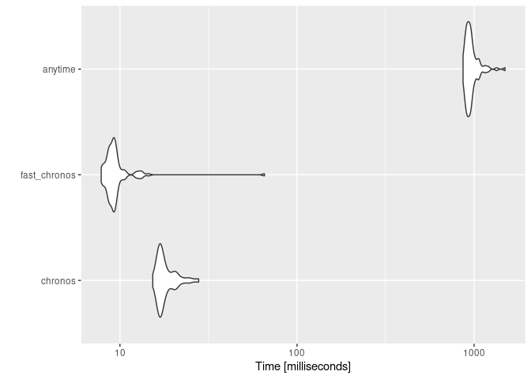
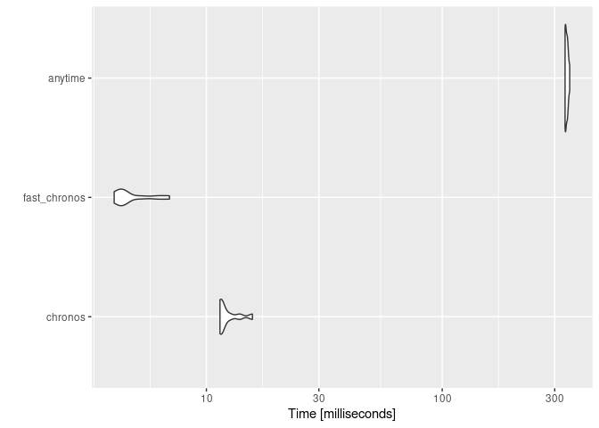
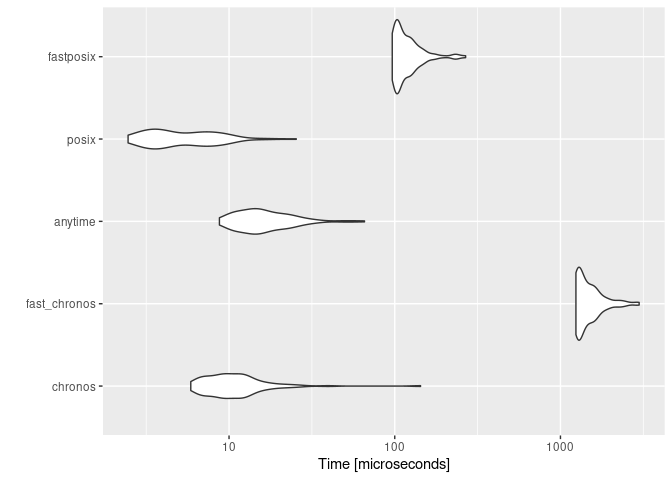
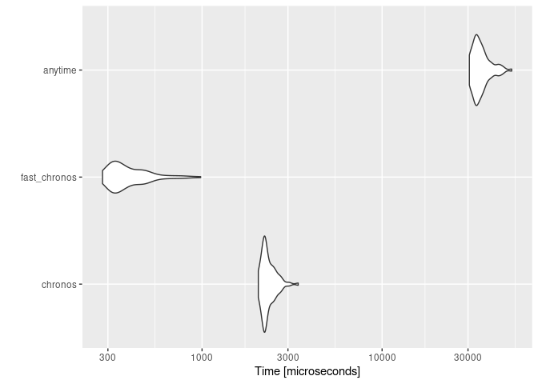

# Benchmarking chronos and anytime


``` r
library(chronos)
library(anytime)
```

The benchmark is done with three datasets that contain a variety of
different date(time) formats.

``` r
bench_datetimes <- readLines("datetime1000.txt")
head(bench_datetimes)
```

    [1] "28 December 1979 12:54AM" "12/21/1991 08:07 AM"     
    [3] "13-03-1979 19:51"         "2007-11-08 01:09:25"     
    [5] "May 29, 1978 07:57"       "2015-05-04 21:55:07"     

``` r
bench_epochs <- readLines("epoch500.txt")
head(bench_epochs)
```

    [1] "717700128" "115153946" "948771719" "586380132" "795097964" "211051179"

``` r
bench_dates <- readLines("dates500.txt")
head(bench_dates)
```

    [1] "September 07, 2018"         "1991.02.14"                
    [3] "12:00 AM December 26, 2000" "April 05, 1996"            
    [5] "June 19, 2014"              "27-Jun-2016"               

``` r
bench <- c(bench_datetimes, bench_epochs, bench_dates)
```

## Ability to parse

This benchmark just checks **if** something was parsed and does **not**
say if the result is actually correct.

``` r
sum_na <- function(x) sum(is.na(x))
data.frame(
    type = c("datetimes", "epochs", "dates", "all"),
    chronos = c(
        sum_na(chronos(bench_datetimes)),
        sum_na(chronos(bench_epochs)),
        sum_na(chronos(bench_dates, out_format = "date")),
        sum_na(chronos(bench))
    ),
    anytime = c(
        sum_na(anytime(bench_datetimes)),
        sum_na(anytime(as.numeric(bench_epochs))),
        sum_na(anydate(bench_dates)),
        sum_na(anytime(bench))
    )
)
```

           type chronos anytime
    1 datetimes       0     322
    2    epochs       0       0
    3     dates       0     138
    4       all       0     949

When epoch times are encoded as characters (which happens when all data
is put together in one vector), then anytime fails to parse most of the
epoch times.

## Runtime

``` r
fast_chronos <- function(x, out_format = "datetime") {
    res <- chronos(x, out_format = "character")
    if (out_format == "datetime") {
        return(fasttime::fastPOSIXct(res))
    } else {
        return(fasttime::fastDate(res))
    }
}
```

### Full data

``` r
mb <- microbenchmark::microbenchmark(
    chronos = chronos(bench),
    fast_chronos = fast_chronos(bench),
    anytime = anytime(bench),
    times = 10L
)
ggplot2::autoplot(mb)
```



### datetime

``` r
mb <- microbenchmark::microbenchmark(
    chronos = chronos(bench_datetimes),
    fast_chronos = fast_chronos(bench_datetimes),
    anytime = anytime(bench_datetimes),
    times = 10L
)
ggplot2::autoplot(mb)
```



### epoch

``` r
bench_epochs_num <- as.integer(bench_epochs)
mb <- microbenchmark::microbenchmark(
    chronos = chronos(bench_epochs_num),
    fast_chronos = fast_chronos(bench_epochs_num),
    anytime = anytime(bench_epochs_num),
    posix = as.POSIXct(bench_epochs_num),
    times = 10L
)
ggplot2::autoplot(mb)
```



### date

``` r
mb <- microbenchmark::microbenchmark(
    chronos = chronos(bench_date, out_format = "date"),
    fast_chronos = fast_chronos(bench_date, out_format = "date"),
    anytime = anydate(bench_date),
    times = 10L
)
ggplot2::autoplot(mb)
```


